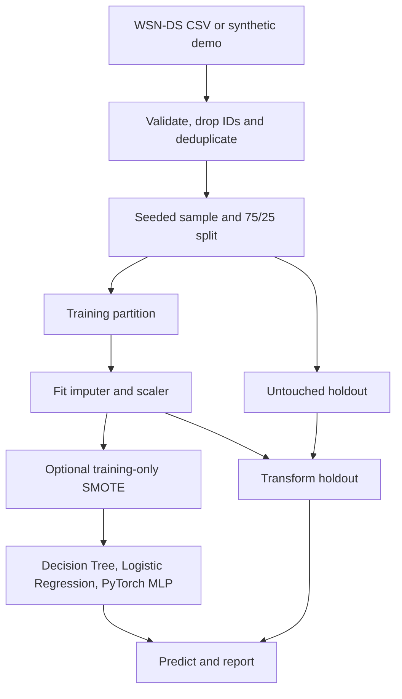

# WSN Attack Detection

Rebuilt in October/2026 from my original university project.

**New AI-assisted implementation.** Original source, weights and historical results
were not recovered. This repository benchmarks Decision Tree, Logistic Regression
and a PyTorch neural network on public WSN-DS research data. See [PROVENANCE.md](PROVENANCE.md).

## Architecture



Stack: Python 3.10+, NumPy, pandas, scikit-learn, imbalanced-learn and PyTorch.
CPU execution is supported; no credentials, hardware or pretrained weights are needed.

## Quick start

Run from the repository root:

```bash
python -m venv .venv
# Linux/macOS:
source .venv/bin/activate
# Windows PowerShell instead: .venv\Scripts\Activate.ps1
python -m pip install -r requirements.txt
python -m pip install -e . --no-deps
python -m pytest -q
python -m wsn_ids.benchmark --demo --smote --epochs 10 --output results/my-demo.json
```

For a smaller CPU installation, install PyTorch first from its official CPU index:
`python -m pip install torch --index-url https://download.pytorch.org/whl/cpu`.
The requirements file keeps scikit-learn and imbalanced-learn at a tested compatible
pair. `requirements-lock.txt` records the exact environment used here; CPU wheel
availability can depend on Python version and operating system.

## Public dataset and reproduction

WSN-DS was created by Iman Almomani, Bassam Al-Kasasbeh and Mousa AL-Akhras using
simulated wireless sensor network traffic. Labels are Normal, Blackhole, Grayhole,
Flooding and Scheduling. [DATASET.md](DATASET.md) credits the paper and public
Kaggle listing and distinguishes dataset terms from this code's MIT license.
Raw data is excluded from Git.

```bash
python scripts/download_dataset.py
python -m wsn_ids.benchmark --csv data/WSN-DS.csv --max-rows 20000 --epochs 30 --output results/wsnds-baseline.json
python -m wsn_ids.benchmark --csv data/WSN-DS.csv --max-rows 20000 --epochs 30 --smote --output results/wsnds-smote.json
```

If the download endpoint changes, obtain the CSV from the linked dataset page.
The tested CSV SHA256 is
`c65d05b983a85753bd62b6f76c5739fc52fe0c14cbb7644255cee4742f5ff7c9`.
Use `--target` for a different label column, `--drop column ...` to exclude
identifiers, and omit `--max-rows` to benchmark the whole deduplicated dataset.
Do not change the sampling/split and compare the numbers as if they were identical.

## Results obtained in this rebuild

These are **new measurements**, not historical university results. Seed 42;
13,502 exact duplicate observations removed after dropping `id`; stratified
20,000-row sample; 15,000 training and 5,000 test rows; same holdout for both runs.
The MLP trained for 30 epochs. SMOTE increased training rows to 68,950.

| Model | Baseline accuracy | Baseline macro F1 | SMOTE accuracy | SMOTE macro F1 |
|---|---:|---:|---:|---:|
| Decision Tree | 0.9928 | 0.9521 | 0.9840 | 0.9231 |
| Logistic Regression | 0.9768 | 0.8516 | 0.9636 | 0.8308 |
| PyTorch MLP | 0.9836 | 0.8826 | 0.9870 | 0.9096 |

Full per-class precision/recall/F1, confusion matrices, training losses, input hash
and test-index hashes are in `results/`. `synthetic-demo.json` is only a software
smoke test on generic generated data; it is not WSN performance evidence.
Three automated tests pass. Both public-data benchmark commands and the synthetic
command ran successfully in the recorded CPU environment.

## Design choices to explain in an interview

- Fit preprocessing after splitting so holdout statistics cannot influence training.
- Drop node ID and exact duplicates to reduce obvious identity and duplicate leakage.
- Use the same seed and holdout in both experiments for a fair SMOTE comparison.
- Use macro F1 alongside accuracy because normal traffic dominates the dataset.
- Resample training data only. SMOTE can help minority classes but does not
  guarantee improvement: it lowered the tree's macro F1 in this experiment.
- Use a small 64/32-unit ReLU MLP with Adam and cross-entropy as an understandable
  baseline. Its architecture is new, not recovered from the original project.
- Use fixed epochs and parameters instead of tuning on the test set. No model was
  selected by repeatedly optimizing these reported holdout results.

## Repository layout

`src/wsn_ids/benchmark.py` contains data validation, preprocessing, model training
and CLI. `tests/` exercises invalid data, deduplication, all three models, and
holdout preservation with SMOTE. `scripts/` contains the public download helper.
`results/` contains small measured JSON reports. `data/` is local and ignored.

## Limitations / Future work

Random splitting can overestimate generalization on correlated simulation records,
even after dropping IDs and duplicates. This is a research baseline, not a deployed
network IDS or proof of performance on unseen devices, sessions or live attacks.
Add device/session/time-separated evaluation, a separate validation partition,
multiple seeds and confidence intervals before drawing broader conclusions.
Scaling and SMOTE include numeric protocol flags, which can create fractional
values; a feature-aware mixed-type sampler is a useful next comparison.
The program currently reports offline metrics and does not save a production
inference bundle, monitor drift, or integrate with a network gateway.

MIT applies to the new source code. Public dataset rights remain with its authors.
